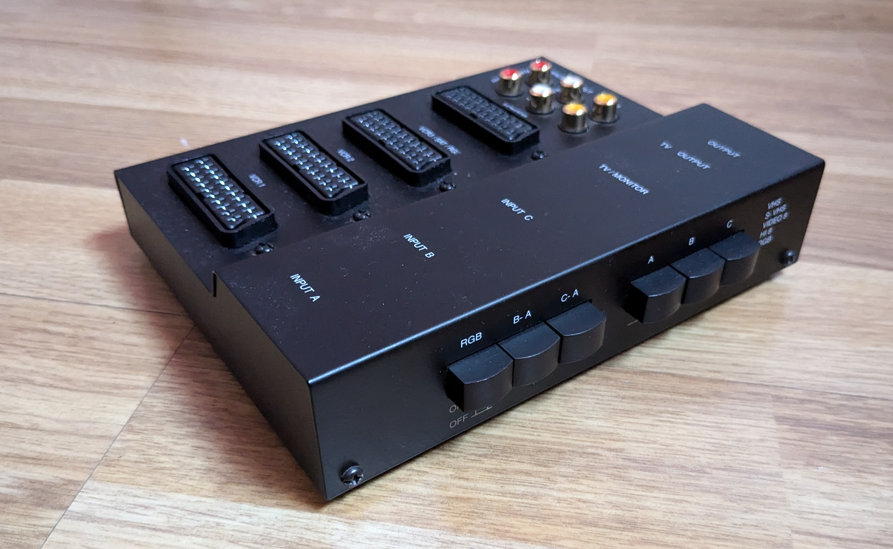
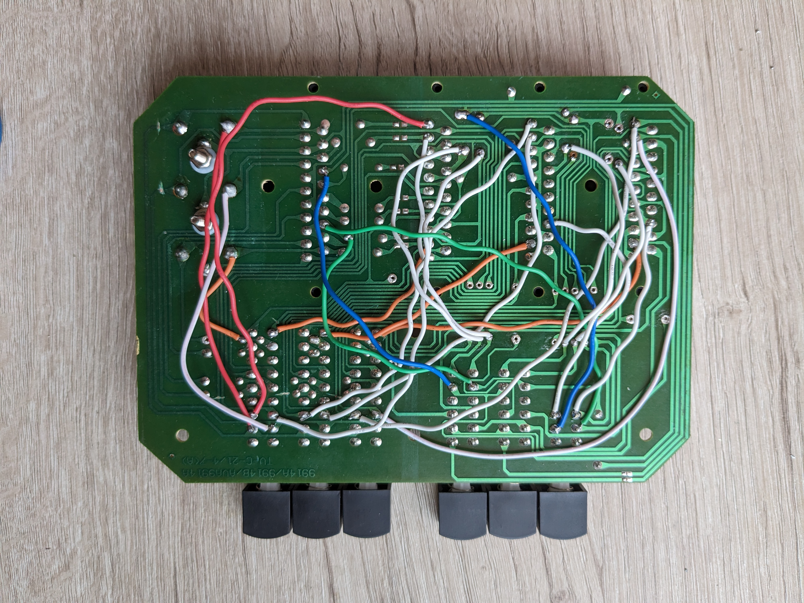
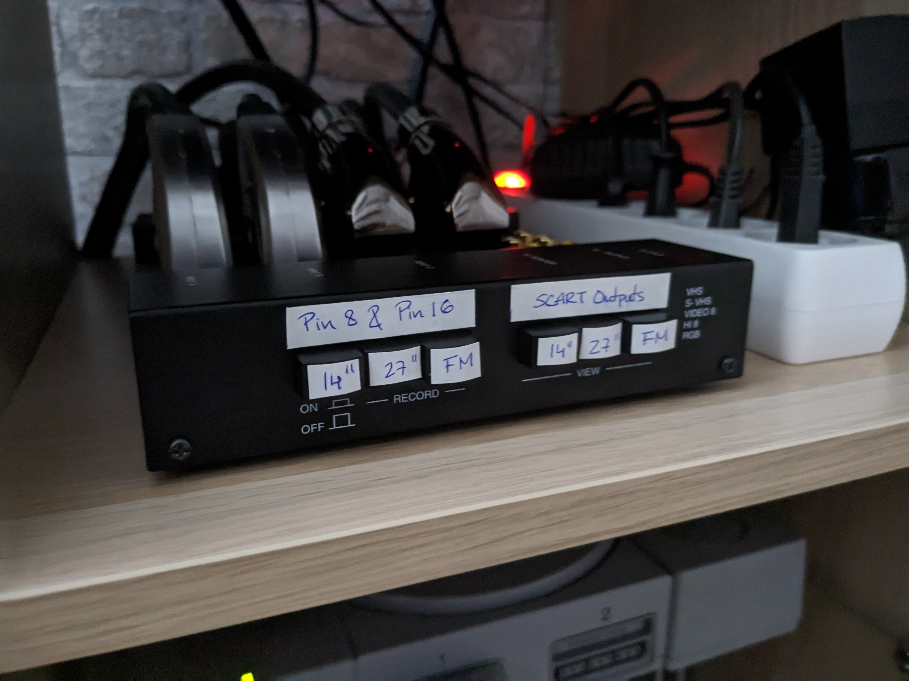
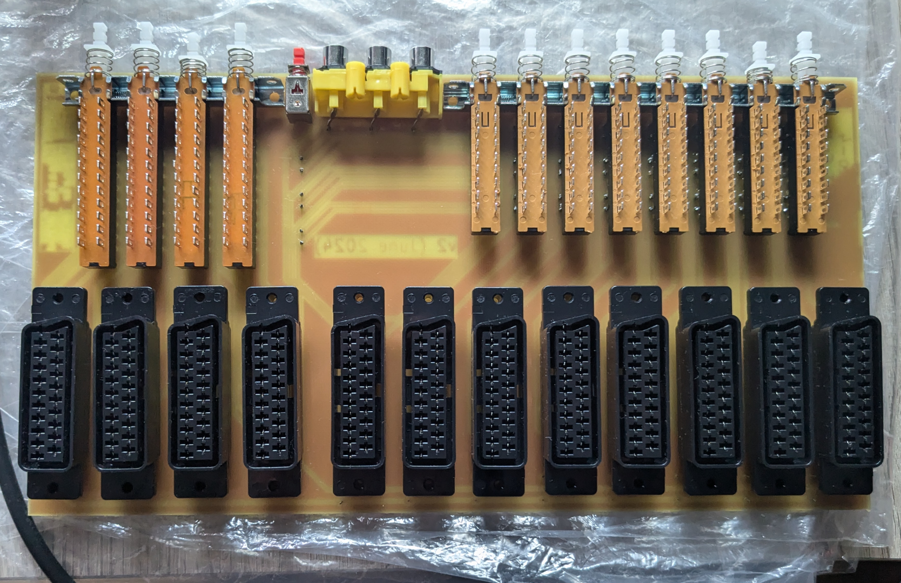
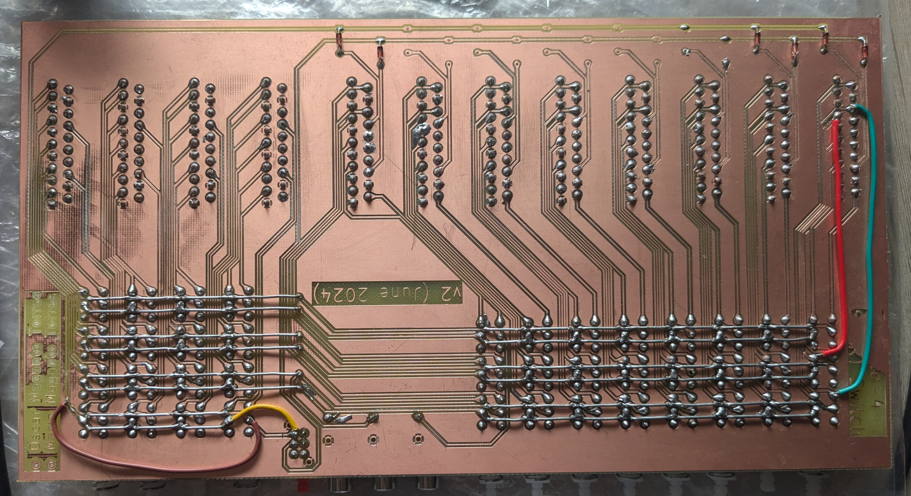

# 8-to-4 SCART Switch

The "8-to-4 SCART Switch" is an open source PCB design for a passive SCART switch capable of (1) redirecting the signal of the selected SCART input device to the selected SCART output device and (2) selecting how the incoming signal is to be sent out (composite/RGB with composite sync or "csync"). It can accommodate for an RCA port to introduce a stereo audio signal or a lightgun signal into the selected output SCART cable.

This PCB was designed in response to the very limited number of output ports (normally 2) on the few SCART switches available for purchase that offer more than one. 

NOTE: this repository contains the KiCAD files for a PCB designed around the constraints detailed [here](#one-side-design). Thus, further adjustments may be necessary for different use-cases so feel free to modify the design so that it may better suit your needs or to expand its functionality. For this same reason, the .STL files for the case displayed in the picture above are not included.
## Table of Contents

* [PCB Breakdown](#pcb-breakdown)
	* [Multiple Inputs](#multiple-inputs)
	* [Multiple Outputs](#multiple-outputs)
	* [Multiple Inputs & Outputs](#multiple-inputs-outputs)
* [Known Issues & Limitations](#known-issues-&-limitations)
	* [One Side Design](#one-side-design)
	* [Single Input and Output](#single-input-and-output)
* [Links to the parts used](#links-to-the-parts-used)

## PCB Breakdown

### Multiple Inputs

The design of the board largely borrows from inexpensive dime in a dozen SCART switches that I have found in hardware stores, like the one pictured below, and whose overall quality I can vouch for after years of use.

The three spring-loaded push buttons labelled "A", "B" and "C" handle one of the SCART input ports each. These spring-loaded push buttons are made up of 18 pins grouped up in 2 columns of 3 pins each. The bottom pin in each column receives the signal from a different pin in the SCART port. Therefore, each group of 2 x 3 pins handles 2 pins, amounting to a total of 6 pins per spring-loaded push button: 

- SCART pin 2 (Right Audio In).
- SCART pin 6 (Left Audio In/ Mono Audio)
- SCART pin 7 (Blue).
- SCART pin 11 (Green).
- SCART pin 15 (Red).
- SCART pin 20 (Composite Video In).

When pushed down, the buttons connect the middle pins with the bottom pins. The incoming signal is then carried across all the other middle pins of the same type that lie between the button and the SCART output port by means of jump wires (hidden on the underside of the board behind some of the ports) and eventually makes it to the corresponding pin on the SCART output port.

It is worth noting that the "corresponding" pin is not always the same pin as in the SCART input port. The Red, Blue and Green video signals travel to the same pins. That is, they travel from pins 15, 11 and 7, respectively, to pins 15, 11 and 7. However, the Composite, Left Audio and Right Audio signals are "crosslinked". In other words, pin 20 (Composite Video In), pin 2 (Right Audio In) and pin 6 (Left Audio In/ Mono Audio) end up on pin 19 (Composite Video Out), pin 1 (Right Audio Out) and pin 3 (Left Audio Out/ Mono) at the other end of any SCART cable. This essentially means that pins 20, 2 and 6 on the SCART input ports have to be routed to pins 19, 1 and 3, respectively.

The two sets of RCA ports on the switch exploit this feature of the design of SCART cables. One of them is connected to all the output pins on the SCART output port, serving as a set of RCA input ports. This is very useful for consoles with mono audio, like the Sega MegaDrive/ Genesis, as the original mono audio signal can be replaced by the stereo audio from the console's headphone jack. Moreover, the Composite Video jack of this set can be used to introduce the signal of a lightgun in lieu of having to plug the lightgun into the TV. The other set of RCA ports is connected to all the input pins on the SCART output port, serving as a set of RCA output ports.

There is only two pins left to address: pin 8 (Status & Aspect Ratio) and pin 16 (RGB Selection). These are routed through separate common traces via 1N4148 diodes (on the underside of the board). Unlike all other pins, pins 8 and 16 carry higher voltages. Pin 8 sits between 5 and 8 V for a 16:9 aspect ratio and between 9.5 and 12 V for a 4:3 aspect ratio. Meanwhile, pin 16 sits between 0 and 0.4 V for a Composite Video Signal and between 1 and 3 V for a RGB Video signal with composite sync or "csync". 

While, the mechanism holding all spring-loaded push buttons together only allows one button to be pushed down at once, it is possible to brute force multiple switches into a pushed down state. As such, the diodes preclude any of the previous signals from feeding back into one another and causing any kind of mayhem. As to why these signals are not routed through the push buttons using sets of 24 pins instead, costs and/or availability may be to blame. When sourcing for these same type of push buttons for this project's PCB design, sets of 24 pin push buttons where much harder to come by and more expensive to boot. It could also be that the board only being printed one side, it couldn't accommodate for even more bespoke traces and all the ensuing jump wires.

Finally, the RGB push button on the switch simply allows the RGB signal through, telling the receiving device to use the signals from the RGB pins for video and the signal from the Composite Video pin as sync ("csync"). When the button is not pushed down, the RGB signal is cut off, telling the receiving device to use the signal from the Composite Video pin for the video signal. 
### Multiple Outputs

To be able to select between multiple outputs instead, it is necessary to change the directionality of the SCART switch described [above](#source-material). The necessary changes to achieve this were carried out on another identical switch by severing the necessary traces and bridging the necessary pins by means of wires. It is far from the most aesthetically-pleasing of solutions but it served as proof-of-concept.

For staters, the directionality of the crosslinked pins had to be reverted. Therefore, pin 20 (Composite Video In), pin 2 (Right Audio In) and pin 6 (Left Audio In/ Mono Audio) on the SCART input port were routed to pin 19 (Composite Video Out), pin 1 (Right Audio Out) and pin 3 (Left Audio Out/ Mono) on the SCART output ports. As the traces on the board were connected to the wrong pins, it was necessary to sever all the traces involved on either end and bypass them using spare wires. The RGB video pins, meanwhile, could be left intact since they connect to the same pins on both ends.

Pins 8 and 16 could not remain routed through their separate common traces. In their default configuration, the diodes would prevent any signal from coming through and simply changing their direction to allow for the signal to go through would defeat their purpose. After all, in doing so, all signals would go through at all times. Instead, the "RGB", "B-A" and "C-A" buttons were used to route these signals to the selected output, which involved further trace severing and wire soldering.

Therefore, to change the selected SCART output port, it was necessary to push down a button from each set. Pushing down the "C" button would send the RGB, Composite Video and Audio signals from the SCART input port to the third SCART output port, and pushing down the "C-A" button would send the Aspect Ratio and RGB-selection signal from the SCART input port to the third SCART output port too. In the photo below, you may more clearly observe how this worked. Note that the unmodified SCART switch is sitting behind and its output is daisy-chained to the SCART input port on the modified SCART switch.

The "RGB", "B-A" and "C-A" buttons were used since the "RGB" push-button was no longer needed for its intended purpose (after all, that was already handled by the same push-button on the 3-to-1 SCART switch) and the "B-A" and "C-A" push buttons were of no use to me.
### Multiple Inputs & Outputs

 

Designing a SCART switch with multiple input and output ports consisted of merging the design of (1) the inexpensive quality SCART switch that I had and (2) the other one whose directionality had successfully been reversed. 

The design of the area comprising the SCART input ports, the RCA ports and the RGB Selection push button was fairly straightforward. All that changed was the number of SCART ports, which was expanded from 3 to 8, and the output RCA port, which I completely removed as I had no real use for them.

As for the design of the area comprising the SCART output ports, a set of four 24 pin push buttons was used to bring into a single set of push buttons the signals that were controlled by the "RGB", "B-A" and "C-A" push buttons in the modified SCART switch.
## Known Issues & Limitations

First of all, the wiring that can be observed on the pictures [above](#merging-all-source-material) is the result of two minor design flaws that have since been corrected and a minor machining flaw:

* The traces that connect pins 8 and 16 were accidentally swapped around, requiring two traces to be severed and two wires to be soldered.
* The RCA connector was accidentally mirrored, causing a mismatch between the colours of the RCA ports and the pins they actually lead to.
* Owing to the levels of tolerance of the milling machine that made the board, two traces from the first SCART input port are permanently bridged, requiring the two traces to be severed and two wires to be soldered in their place.
### One Side Design 

Due to the sheer size of a PCB with this many ports, I only had access to machinery capable of making milled PCBs and the machinery in question could only mill on one side of the board, making it necessary to resort to jump wires like the SCART switches I used for reference.

This does not appear to affect any of the signals getting to the SCART output ports. At most, there is a nigh imperceptible loss of brightness that only my FrameMeister upscaler manages to pick up and which is only really noticeable on my Sega MegaDrive/ Genesis. Albeit it could be the result of the signal travelling over too many jump wires, this console uses a cheap RGB cable that might be to blame. The rest of my retro consoles are paired up with high quality RGB SCART cables from [Retro Gaming Cables](https://www.retrogamingcables.co.uk/).

Regardless, had it been possible to mill on the other side of the board, the pins connected by the jumper wires would have been connected to traces on the other side by means of vias. Needless to say, it would have made soldering easier and the end-result would have been nicer.

The pictures above are for you to form your own opinion. They are screenshots taken using a FrameMeister upscaler. The only difference between each screenshot lies on how far the SCART signal has had to travel: 

* "Frameister" means that the console's SCART cable has been directly plugged into the FrameMeister.
* "Switch v1" refers to the proof-of-concept switch that was modified to have its directionality reversed. In this case, the console's SCART cable was plugged into the unmodified switch, which, in turn, was daisy-chained into the modified switch whose output was then plugged into the FrameMeister.
* "Switch v2" refers to this project's switch.

In both cases, for "longest distance" screenshots the console's SCART cable and the SCART output cable have been set as far apart as possible, forcing the signal to travel the greatest length of jump wires possible. For "shortest distance" screenshots both cables have been set as close as possible to one another so that the signal has to travel the least. 

To my untrained eye, this does not appear to make much of a difference, not even in "Switch v1" screenshots, where the signal had to travel through an extra SCART cable connecting two switches.
### Single Input and Output

As a passive SCART switch by design, it is not possible to redirect the selected SCART input device to more than one SCART  output device. While more than one push button can be brute forced into a pushed down state, it would be necessary to boost the incoming image somehow for it to show correctly or even show at all in all devices. This would require a source of external power.

Lastly, due to the simplicity of the design of the board, it is not possible to mix and match inputs and outputs. A single selected input can only be routed to a single selected output.
## Links to the parts used

* [1x RCA port](https://es.aliexpress.com/item/1005006295411086.html?algo_exp_id=1704070b-437d-4806-bd52-9b4e4fd31481-30&pdp_npi=4%40dis%21EUR%215.68%211.82%21%21%2143.37%2113.88%21%40211b612517121802582044392eeff7%2112000036647428960%21sea%21ES%214782931422%21&curPageLogUid=3xNMGX6dJbsL&utparam-url=scene%3Asearch%7Cquery_from%3A)
* [12x female SCART ports](https://es.aliexpress.com/item/1005006636475708.html?algo_exp_id=9e1a5876-f124-43f7-b40c-11d20e1f46cf-22&pdp_npi=4%40dis%21EUR%211.55%211.45%21%21%211.63%211.52%21%40211b617a17121800592552603eb1fc%2112000037887909284%21sea%21ES%214782931422%21&curPageLogUid=zIvDoxFjqDd9&utparam-url=scene%3Asearch%7Cquery_from%3A)
* [1x 8 pin spring-loaded push button](https://es.aliexpress.com/item/1005006186944454.html?pvid=55b27e62-d06f-4987-be3b-784640dc741e&_t=gps-id%3ApcDetailTopMoreOtherSeller%2Cscm-url%3A1007.40000.327270.0%2Cpvid%3A55b27e62-d06f-4987-be3b-784640dc741e%2Ctpp_buckets%3A668%232846%238111%231996&pdp_npi=4%40dis%21EUR%213.44%211.03%21%21%2126.29%217.89%21%402103871e17121795811912119eab58%2112000036185800227%21rec%21ES%214782931422%21&utparam-url=scene%3ApcDetailTopMoreOtherSeller%7Cquery_from%3A)
* [1 set of 8 18 pin spring-loaded push buttons](https://es.aliexpress.com/item/32977337144.html?pvid=ed7a91a2-8967-4df6-9983-d61c363a6160&_t=gps-id%3ApcDetailTopMoreOtherSeller%2Cscm-url%3A1007.40000.327270.0%2Cpvid%3Aed7a91a2-8967-4df6-9983-d61c363a6160%2Ctpp_buckets%3A668%232846%238110%231995&pdp_npi=4%40dis%21EUR%212.83%212.83%21%21%212.98%212.98%21%402103871e17121797616365716eab58%2112000030624642228%21rec%21ES%214782931422%21&utparam-url=scene%3ApcDetailTopMoreOtherSeller%7Cquery_from%3A)
* [1 set of 4 24 pin spring-loaded push buttons](https://es.aliexpress.com/item/1005005575498175.html?gatewayAdapt=glo2esp)

